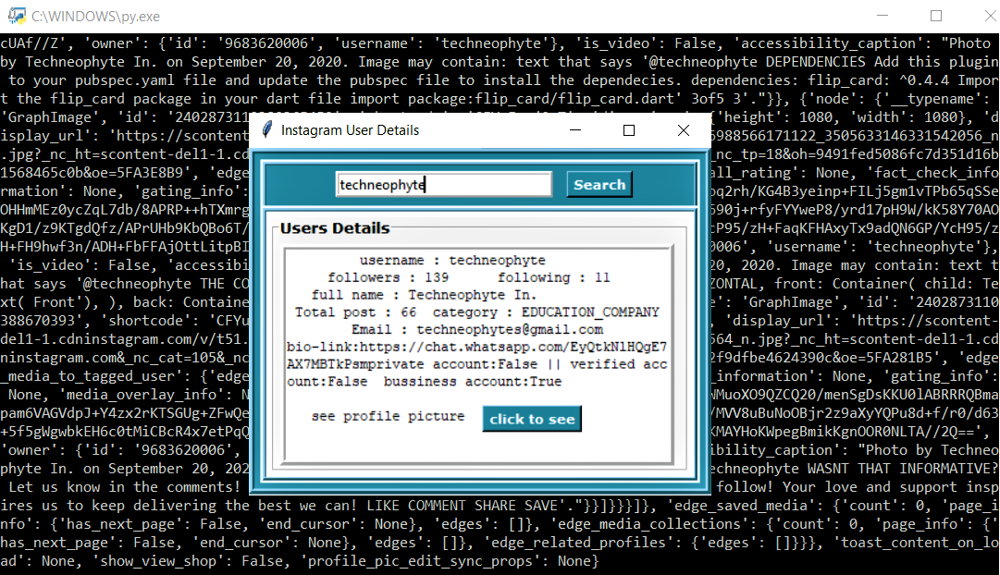

# InstaWhoIs

<!-- PROJECT LOGO -->
 

  

<!-- TABLE OF CONTENTS -->
## Table of Contents

* [About the Project](#about-the-project)
  * [Built With](#built-with)
* [Getting Started](#getting-started)
  * [Prerequisites](#prerequisites)

* [Contributing](#contributing)
* [License](#license)
* [Contact](#contact)
* [Acknowledgements](#acknowledgements)

<!-- ABOUT THE PROJECT -->
## About The Project

A GUI application written in python which gives you all the details related to an Instagram Id.

### Built With
The major frameworks that we used to built our project are:
* [Python](https://python.com)
* [Tkinter](https://docs.python.org/3/library/tkinter.html)

<!-- GETTING STARTED -->
## Getting Started

Clone the project and open it in any IDE suitably in Pycharm and execute the main.py file and wait for the Application window to load.
After that follow the onscreen instructions and you are good to go.

### Prerequisites

'''cmd
pip install requests
'''

<!-- CONTRIBUTING -->
## Contributing

Contributions are what make the open source community such an amazing place to be learn, inspire, and create. Any contributions you make are **greatly appreciated**.

1. Fork the Project
2. Create your Feature Branch (`git checkout -b feature/AmazingFeature`)
3. Commit your Changes (`git commit -m 'Add some AmazingFeature'`)
4. Push to the Branch (`git push origin feature/AmazingFeature`)
5. Open a Pull Request

<!-- LICENSE -->
## License

Distributed under the MIT License. See `LICENSE` for more information.

<!-- CONTACT -->
## Contact

Techneophyte - [@techneophyte](https://www.instagram.com/techneophyte/?hl=en) 

Project Link: [https://github.com/your_username/repo_name](https://github.com/your_username/repo_name)

